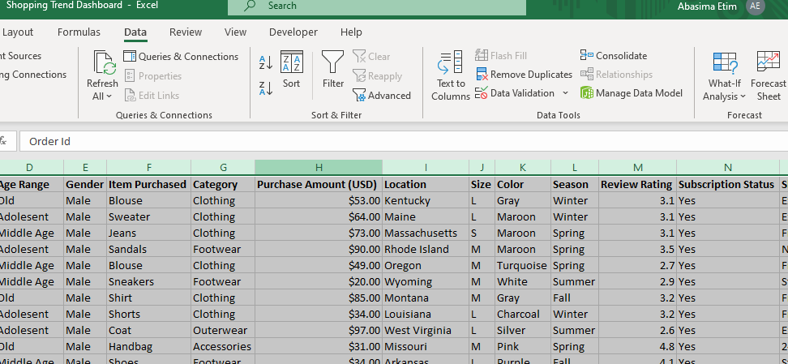

# Shopping Trend Analysis

----
## Introduction
This Microsoft Excel project analyzes shopping trends of an imaginary fashion store to provide valuable insights for marketing campaigns. The aim of this project is to answer crucial questions that will help the marketing department effectively channel their efforts and maximize their impact.

## Problem Statement
The marketing department aims to launch a campaign in the second quarter of 2024. However, they require a dashboard to monitor business activity during the waiting period. This will provide insights into where to channel the campaign efforts. The Marketing lead would like to track various metrics over time, including product performance, changes in customers' choice of color, location, and seasonality patterns in relation to orders. Additionally, any other metric(s) deemed necessary should be incorporated into the dashboard.

## Skills and Concepts Demonstrated
- Data Collection
- Data Transformation/cleaning
- Data Visualization/Analysis
- Communication/Recommendation

## Data Collection
For this project, the dataset was obtained as a CSV file. I imported it into Excel for further analysis.

Excel file        |     Csv file
:----------------:|:------------------
|

## Data Transformation/Cleaning
1. Making first row as headers

---------

2. Removed Duplicate

-----

3. Changed the data type in the purchase Amount

-----

5. Find and replaced missing Data and errors in the Customer ID and color column

Customer Id    | Color
:-------------:|:-----------
|
:-------------:|:--------------
  Empty        |
------------
6. Removed Ouliers
   
 
   
---------------

7. Created a new column called **Age Range** from the Age column
   
   

## Data Visualization/Analysis

I created my pivot table from the cleaned dataset.

#### Top Performing Products
Blouses are the best-selling product with the highest amount being sold at $10,410, followed by dresses, Shirts, pants, and jewelry.

----

#### Top Preferred Colors
Olive is the most popular color, followed by sliver and yellow. There is a preference for teal and green colors

-----
### Purchase percentage by Age Range
It has been found that people aged 31 to 50 demonstrate higher purchasing behavior compared to other age groups with an average of 45%, followed by those that are old.

----
### Top Locations by Purchase Amount
Both location and product reveal interesting shopping trends: Montana boasts the highest overall purchasing rate, with clothing being the most popular category.

----
### Seasonal Purchase Trend
According to the analysis, fall is the most popular season for purchase, followed by spring, winter, and summer.

----

### Frequency of Purchase
According to the anlysis, customers purchase most frequently every 3 months.

---
### The Dashboard 

*To interact with the dashboard, click [here](https://1drv.ms/x/c/97e2ae96d52322d8/EfmMHh7lAHNHsZkGWSMTKCABSCxaBanLbLfYvr-i94k6Og)*

## Conclusion and Recommendation
### For products to promote:
- The marketing department should focus more on clothing (blouses, dresses and shirts) followed by accessories. These are top-selling categories with high purchase amounts. 

- They should also consider promoting specific colors like olive, silver, and  yellow, For which are customer favorites.

- Also, target accessories and footwear alongside clothing to encourage larger basket sizes.

### For  target Locations:
- The Marketing department should prioritize Montana, as it has the highest overall purchasing rate. California and Illinois should also be looked into expecially when it has to do with clothings 

### Age group to focus on:
- People within the ages of 31-50 has the highest purchase volume, so campaigns should be tailored accordingly.

### Best seasons to sell:
- The marketing department should focus on fall and spring campaigns, as these are the most popular purchase seasons.
- Winter and summer still see sales, so consider offering seasonal promotions or introducing relevant products.

## The End 🙂
 
